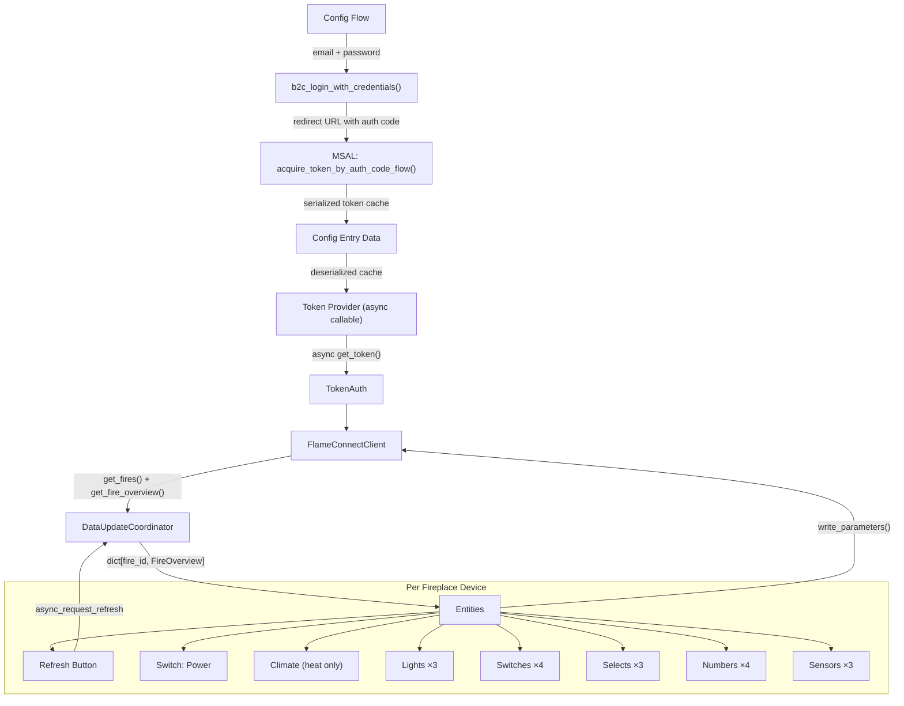
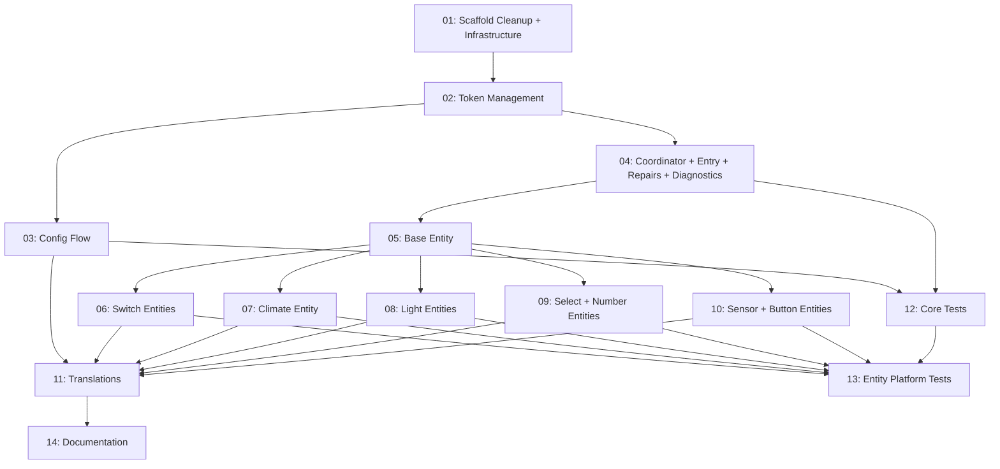

# Plan: FlameConnect Home Assistant Integration

## Original Work Order

> Create in this repository a Home Assistant custom component to control fireplaces using the https://github.com/deviantintegral/flameconnect library. The component should support controlling all the same aspects of the fireplace that the TUI / CLI does. Each registered fireplace should be its own device in Home Assistant. As well, the component should by default not automatically poll the API for states of the fireplace. Instead, expose a button entity to refresh data. For authentication, Home Assistant should ask for the username and password during setup, and use it to authenticate in a manner similar to the TUI. It should not store the username and password after, instead using the OAuth tokens.

## Plan Clarifications

| # | Question | Answer |
|---|----------|--------|
| 1 | How should main fireplace power (STANDBY/MANUAL mode) be controlled? The library separates power from heat — a fireplace can be ON with heat OFF. | **Separate switch entity** for main power on ALL fireplaces. Climate entity controls only heat settings (heat-capable fireplaces only). Switch ON = MANUAL, Switch OFF = STANDBY. |
| 2 | Should less commonly used entities default to disabled to reduce UI clutter (~20 entities per fireplace)? | **Yes.** Diagnostic sensors (software version, error codes, connection state) and setting entities (sound volume, sound file) are created but disabled by default. Core controls (power, flame, heat, lights, timer) are enabled. |
| 3 | Should a temperature unit select entity be exposed? | **No.** The integration should use HA's configured temperature unit and convert to Celsius internally for API calls when needed. Remove the temperature unit select entity. |

## Executive Summary

This plan replaces the current scaffolded/demo code in the FlameConnect HA integration with a production implementation that uses the `flameconnect` PyPI library (v0.3.0) directly. The integration will use Azure AD B2C authentication via the library's `b2c_login_with_credentials` function during config flow setup, then persist only the serialized MSAL token cache (containing OAuth refresh tokens) in the config entry — never storing username or password.

Each fireplace discovered via the API becomes its own HA device. A **switch entity** controls main power (STANDBY/MANUAL) for all fireplaces, while a **climate entity** manages heat settings for heat-capable fireplaces only. Additional entities cover all remaining TUI features: lights (media/overhead/log effect with RGBW), switches (flame effect, pulsating, ambient sensor, timer), selects (flame color, brightness, media theme), numbers (flame speed, timer duration, sound volume, sound file), sensors (connection state, software versions, error codes), and a button to manually trigger data refresh. Diagnostic and setting entities are created disabled by default to reduce clutter.

The coordinator polls automatically once every 24 hours (with a random 0–60 minute jitter per installation to avoid thundering herd across HA instances), and a button entity allows manual refresh on demand. The integration uses `FlameConnectClient` from the library directly — no wrapper layer — and respects HA's configured temperature unit, converting to Celsius for API calls as needed.

## Context

### Current State vs Target State

| Current State | Target State | Why? |
|---|---|---|
| Scaffolded demo code using JSONPlaceholder API | Real API calls via `flameconnect` library | Demo code has no actual functionality |
| Username/password stored in config entry data | Only serialized MSAL token cache stored; credentials discarded after auth | Security: avoid persisting user credentials |
| Single device per config entry based on entry_id | One device per fireplace from `get_fires()` | Each fireplace is a distinct physical device |
| 1-hour automatic polling interval | 24-hour automatic polling (with jitter) + manual refresh button | Keeps refresh tokens alive; minimizes API load |
| Example entities (air quality, fan, humidity) | Fireplace-specific entities (switch, climate, lights, selects, numbers, sensors, button) | Must match TUI/CLI feature set |
| Custom API client wrapper with exception hierarchy | Use `flameconnect.FlameConnectClient` directly | Library handles all protocol and API details; no wrapper needed (YAGNI) |
| No `requirements` in manifest.json | `flameconnect==0.3.0` as requirement | Library provides all API functionality |
| Scaffold options flow, example services, diagnostics | Remove unused scaffold code | YAGNI: these features were not requested |

### Background

The `flameconnect` library (v0.3.0 on PyPI) communicates with the Flame Connect cloud API (`mobileapi.gdhv-iot.com`) using Azure AD B2C authentication. It supports three API endpoints: listing fireplaces, fetching fireplace overview (decoded parameters), and writing parameters. The library requires Python >=3.13, which aligns with this project's configuration (Python 3.13.2+).

**Authentication architecture**: The library provides two auth mechanisms:
- `MsalAuth`: Uses MSAL library with **file-based** token cache — designed for CLI/TUI use. Not suitable for HA (file paths, no config entry integration).
- `TokenAuth`: Accepts a static token or **async callable** that returns a token string — designed for integration use. This is the integration point for HA.

The library also includes `b2c_login_with_credentials(auth_uri, email, password) -> str` which automates Azure B2C credential submission via direct HTTP requests, returning a redirect URL containing the authorization code. This is how the TUI authenticates.

**Key constraint**: The API is unversioned and can change at any time. Error handling must be robust.

**Library data model field names** (verified against source code):
- `FlameEffectParam` fields: `flame_effect`, `flame_speed`, `brightness`, `pulsating_effect` (not `pulsating`), `media_theme`, `media_light`, `media_color`, `overhead_light`, `overhead_color`, `light_status`, `flame_color`, `ambient_sensor`
- `TempUnitParam` field: `unit` (not `temp_unit`)
- `LogEffectParam` fields: `log_effect`, `color`, `pattern`
- All parameter dataclasses are `frozen=True` — modifications require `dataclasses.replace()`

## Architectural Approach



### Authentication & Token Management

**Objective**: Authenticate using username/password during setup, then persist only OAuth tokens for ongoing access.

The HA integration does **not** use the library's `MsalAuth` class (which relies on file-based caching). Instead, it builds the MSAL application directly:

**Config flow (initial setup and reauth):**
1. Collect email and password from the user
2. Create an `msal.PublicClientApplication` with the library's `CLIENT_ID` and `AUTHORITY` constants, attached to an in-memory `msal.SerializableTokenCache`
3. Call `initiate_auth_code_flow(scopes=SCOPES, redirect_uri=REDIRECT_URI)` to get the auth flow object (contains `auth_uri`)
4. Call `b2c_login_with_credentials(auth_uri, email, password)` to get the redirect URL containing the authorization code
5. Parse the redirect URL and call `acquire_token_by_auth_code_flow(flow, auth_response)` to exchange the code for tokens
6. Serialize the token cache via `cache.serialize()` → store as `config_entry.data["token_cache"]`
7. Set the config entry unique_id to the slugified email address (prevents duplicate entries for the same account)
8. Set the config entry title to the email address (for display in the UI)
9. **Discard** email and password — they are not stored in the config entry data (only `token_cache` is stored)

**Runtime token refresh:**
1. Deserialize the token cache from `config_entry.data["token_cache"]`
2. Create `msal.PublicClientApplication` with the deserialized cache
3. Call `acquire_token_silent(SCOPES, account=accounts[0])` to get/refresh the access token
4. If the cache state changes (refresh token rotated), update the config entry data with the new serialized cache
5. Wrap this logic in an async callable: `async def get_token() -> str`
6. Pass the callable to `TokenAuth(get_token)` → provide to `FlameConnectClient`

**Token expiry handling:** If `acquire_token_silent` fails (refresh token expired, typically after ~90 days), the token provider raises an exception that the coordinator maps to `ConfigEntryAuthFailed`, which triggers HA's built-in reauth flow. Additionally, a **repair issue** is created to surface the problem prominently to the user (see Reauth Repair Flow below).

The constants `CLIENT_ID`, `AUTHORITY`, `SCOPES`, and the redirect URI format `msal{CLIENT_ID}://auth` are imported from `flameconnect.const`.

### API Client — Direct Library Use

**Objective**: Use `FlameConnectClient` from the library directly, without a wrapper layer.

*Per clarification: the original plan proposed a thin wrapper with exception mapping. This is unnecessary — the coordinator catches library exceptions directly.*

The existing `api/` package is repurposed to hold:
- **Token management code**: The async callable that handles MSAL token refresh, config entry updates, and error signaling
- **Exception re-exports**: Convenient imports of `flameconnect.AuthenticationError`, `flameconnect.ApiError`, etc. for use by the coordinator

The `FlameConnectClient` is instantiated in `async_setup_entry` with:
- `auth`: A `TokenAuth` instance wrapping the token provider callable
- `session`: HA's shared `aiohttp.ClientSession` via `async_get_clientsession(hass)`

Since an external session is provided, the client does NOT own the session and will not close it.

### Coordinator & Data Model

**Objective**: Fetch and cache fireplace state for all entities, with manual-only refresh.

The coordinator is initialized with `update_interval=timedelta(hours=24) + timedelta(minutes=randint(0, 60))`. The random jitter (0–60 minutes) is computed once at coordinator creation and remains stable for the coordinator's lifetime. This serves two purposes: (1) keep the OAuth refresh token alive by exercising it at least daily, and (2) distribute API load across independent HA installations. HA's built-in coordinator jitter is only 0.05–0.50 seconds (designed for intra-instance staggering), which is insufficient for cross-installation distribution on a 24h interval. The button entity remains available for on-demand manual refresh via `coordinator.async_request_refresh()`.

**`_async_setup`**: Calls `client.get_fires()` to discover all fireplaces. Stores the fire list for device registration and entity creation.

**`_async_update_data`**: Calls `client.get_fire_overview(fire_id)` for each fireplace and returns a `dict[str, FireOverview]` mapping fire_id to its current state. Exception handling:
- `flameconnect.AuthenticationError` → raise `ConfigEntryAuthFailed` (triggers reauth)
- `flameconnect.ApiError` / `flameconnect.FlameConnectError` → raise `UpdateFailed`

The `FlameConnectData` runtime dataclass holds:
- `client`: The `FlameConnectClient` instance (from the library)
- `coordinator`: The `FlameConnectDataUpdateCoordinator` instance

Note: The discovered `list[Fire]` is stored as a coordinator attribute (set during `_async_setup`), not on `FlameConnectData`, because fire discovery happens inside the coordinator's first refresh which runs after `FlameConnectData` is created. Entity platforms access it via `coordinator.fires`.

### Device Registration

**Objective**: Create one HA device per fireplace with rich device info from the `Fire` model.

Each `Fire` object from the API provides identity and capability fields. Device info maps to:
- `identifiers`: `{(DOMAIN, fire_id)}`
- `name`: `friendly_name`
- `manufacturer`: `brand` (e.g., "Dimplex")
- `model`: `product_type` (e.g., "Bold Ignite XL")
- `model_id`: `product_model` (e.g., "BIX-50")
- `sw_version`: From `SoftwareVersionParam` (if available in coordinator data)

### Entity Layer

**Objective**: Expose all TUI-controllable features as appropriate HA entity types.

The base `FlameConnectEntity` is updated to:
- Accept a `fire_id` parameter for multi-device support
- Generate unique IDs as `{fire_id}_{entity_description_key}`
- Look up its fireplace's data from `coordinator.data[fire_id]`
- Provide a helper method to extract a specific parameter type from the `FireOverview.parameters` list (e.g., `_get_param(FlameEffectParam)` returns the `FlameEffectParam` or `None`)

**Entity categories and default enabled state:**
- **Enabled by default**: Power switch, flame effect switch, climate, lights, flame color, brightness, flame speed, timer switch, timer duration, refresh button
- **Disabled by default** (`entity_registry_enabled_default=False`): Sound volume, sound file (entity_category=CONFIG); connection state sensor, software version sensor, error codes sensor (entity_category=DIAGNOSTIC)

#### Switch: Power (1 per fireplace)
- **All fireplaces**, regardless of heat capability
- ON → `ModeParam(mode=FireMode.MANUAL, target_temperature=<preserved>)`
- OFF → `ModeParam(mode=FireMode.STANDBY, target_temperature=<preserved>)`
- Preserves the current `target_temperature` from cached `ModeParam`

#### Climate Entity (1 per fireplace with heat support)
- Only created when `Fire.with_heat` is True
- **HVAC modes**: `OFF` (HeatStatus.OFF), `HEAT` (HeatStatus.ON)
- **Preset modes**: Normal, Boost, Eco, Fan Only, Schedule (from `HeatMode` enum)
- **Target temperature**: From `HeatParam.setpoint_temperature`
- **Temperature unit**: The climate entity declares `temperature_unit = UnitOfTemperature.CELSIUS`. HA automatically handles display conversion to the user's preferred unit. When the user sets a temperature, HA converts from display unit to Celsius before passing to the entity. If the fireplace is natively configured in Fahrenheit (from `TempUnitParam.unit`), the integration converts API-returned Fahrenheit values to Celsius when reading, and converts Celsius back to Fahrenheit when writing. This ensures the API always receives values in the fireplace's native unit while the integration works in Celsius internally.
- **Supported features**: `TARGET_TEMPERATURE | PRESET_MODE`
- Writes `HeatParam` with updated fields via `dataclasses.replace()`

#### Light Entities (up to 3 per fireplace)
- **Media light**: RGBW color support, on/off via `FlameEffectParam.media_light`, color via `FlameEffectParam.media_color`, effects from `MediaTheme` enum
- **Overhead light**: RGBW color support, on/off via `FlameEffectParam.light_status` (**not** `overhead_light` — see Notes/light_status investigation), color via `FlameEffectParam.overhead_color`
- **Log effect light**: On/off via `LogEffectParam.log_effect`, RGBW color via `LogEffectParam.color`

#### Switch Entities (up to 4 per fireplace)
- **Flame effect**: On/off via `FlameEffectParam.flame_effect`
- **Pulsating effect**: On/off via `FlameEffectParam.pulsating_effect`
- **Ambient sensor**: On/off via `FlameEffectParam.ambient_sensor`
- **Timer**: Enable/disable via `TimerParam.timer_status`

#### Select Entities (3 per fireplace)
- **Flame color**: Options from `FlameColor` enum (All, Yellow Red, Yellow Blue, Blue, Red, Yellow, Blue Red)
- **Brightness**: Options from `Brightness` enum (High, Low)
- **Media theme**: Options from `MediaTheme` enum (User Defined, White, Blue, Purple, Red, Green, Prism, Kaleidoscope, Midnight)

*Temperature unit select removed per clarification — HA's unit is used instead.*

#### Number Entities (up to 4 per fireplace)
- **Flame speed**: Range 1–5 (from `FlameEffectParam.flame_speed`), step 1
- **Timer duration**: Range 1–480 minutes (from `TimerParam.duration`), step 1
- **Sound volume**: From `SoundParam.volume` — disabled by default, entity_category=CONFIG
- **Sound file**: From `SoundParam.sound_file` — disabled by default, entity_category=CONFIG

#### Sensor Entities (read-only, up to 3 per fireplace)
All sensor entities are entity_category=DIAGNOSTIC and disabled by default.
- **Connection state**: From `Fire.connection_state` (Unknown, Not Connected, Connected, Updating Firmware)
- **Software version**: Combines UI, control, and relay versions from `SoftwareVersionParam`
- **Error codes**: From `ErrorParam` (4 error bytes)

#### Button Entity (1 per fireplace)
- **Refresh data**: Calls `coordinator.async_request_refresh()` to fetch latest state from the API

### Write Operations

**Objective**: Allow entities to send parameter changes to the fireplace via the library client, using fresh state to avoid overwriting changes made outside HA.

The fireplace API does **not** support partial updates — `write_parameters()` encodes the entire parameter dataclass as a binary blob. If stale cached data is used, fields changed via the mobile app or the fireplace itself would be silently overwritten. The library's own CLI follows a strict read-before-write pattern (15 of 17 `_set_*` functions call `get_fire_overview()` before writing).

When an entity's state is changed (e.g., user turns on the flame effect), the entity:
1. Calls `client.get_fire_overview(fire_id)` to get **fresh** state from the API
2. Extracts the relevant parameter from the response (e.g., `FlameEffectParam`)
3. Constructs a new parameter using `dataclasses.replace()` on the fresh parameter, changing only the target field
4. Calls `client.write_parameters(fire_id, [new_param])`
5. Calls `await coordinator.async_request_refresh()` to update all entities with the confirmed state

**Exception — simple parameters**: `TimerParam` (2 fields, both user-specified) and `TempUnitParam` (1 field) can be constructed from scratch without reading first, since they have no "other state" to preserve. This matches the library's CLI pattern.

**Multi-field parameter handling (FlameEffectParam)**: Since `FlameEffectParam` bundles 12 fields into one wire packet, any write to a single field (e.g., `flame_effect`) must send all other fields unchanged. The entity always starts from a **fresh** `get_fire_overview()` response and uses `dataclasses.replace()` to change only the target field, preserving all others.

### Scaffold Cleanup

**Objective**: Remove all demo/placeholder files that are being replaced.

Files to **delete**:
- `api/client.py` (replaced by direct library use + token management)
- `sensor/air_quality.py`, `sensor/diagnostic.py` (replaced by fireplace sensors)
- `binary_sensor/connectivity.py`, `binary_sensor/filter.py` (replaced by connection state sensor)
- `switch/example_switch.py` (replaced by fireplace switches)
- `button/reset_filter.py` (replaced by refresh button)
- `select/fan_speed.py` (replaced by fireplace selects)
- `fan/air_purifier_fan.py` (no fan platform needed)
- `number/target_humidity.py` (replaced by fireplace numbers)
- `service_actions/example_service.py`, `service_actions/__init__.py` (no custom services needed — remove entire `service_actions/` package)
- `services.yaml` (no custom services; remove the file entirely)
- `config_flow_handler/options_flow.py` (no options flow needed)
- `config_flow_handler/subentry_flow.py` (not needed)
- `coordinator/data_processing.py`, `coordinator/error_handling.py`, `coordinator/listeners.py` (scaffold extras)
- `entity_utils/device_info.py`, `entity_utils/state_helpers.py` (device info moves to base entity)
- `utils/validators.py`, `utils/string_helpers.py` (unused scaffold utilities)

Directories to **remove** entirely: `fan/`, `binary_sensor/`, `service_actions/`

Directories to **create**: `climate/`, `light/`

Files to **rewrite**: `__init__.py`, `const.py`, `data.py`, `config_flow.py`, `config_flow_handler/config_flow.py`, `config_flow_handler/schemas/config.py`, `config_flow_handler/validators/credentials.py`, `coordinator/base.py`, `entity/base.py`, `diagnostics.py` (update to redact token_cache from config entry data), `repairs.py` (rewrite for reauth repair flow), `translations/en.json`, `manifest.json`

Note: `__init__.py` must remove the `async_setup_services` import/call and the `Platform.BINARY_SENSOR` and `Platform.FAN` entries from the PLATFORMS list.

### Translation & UI

**Objective**: Provide English translations for all config flow steps and entity names.

The `translations/en.json` file will be updated with config flow step labels (user setup, reauth), entity names, and select option labels. Entity names should be human-friendly (e.g., "Media Light", "Flame Speed", "Overhead Light"). Error messages for auth failures and connection errors should also be translated.

### Reauth Repair Flow

**Objective**: Surface authentication failures as a repair issue so the user can reauthenticate with their username and password.

When the coordinator catches an `AuthenticationError` (token refresh failed), it:
1. Raises `ConfigEntryAuthFailed` (triggers HA's built-in reauth flow)
2. Creates a repair issue via `async_create_issue()` with severity `ERROR`, explaining that authentication has expired and the user needs to reauthenticate

The `repairs.py` module implements a `RepairsFlow` that guides the user to the reauth config flow step where they re-enter their email and password. After successful reauthentication (new token cache stored), the repair issue is automatically deleted via `async_delete_issue()`.

This ensures authentication failures are visible in HA's **Repairs** dashboard, not just buried in the integrations page reauth badge.

### Manifest Updates

**Objective**: Declare the `flameconnect` library as a requirement.

The `manifest.json` will be updated to include `"requirements": ["flameconnect==0.3.0"]` so HACS and HA install the library automatically.

### Automated Testing

**Objective**: Achieve high test coverage across config flow, coordinator, entity platforms, and write operations using HA-standard testing patterns.

The project already has the testing infrastructure in place: `pytest-homeassistant-custom-component==0.13.314` in `requirements_test.txt`, full pytest configuration in `pyproject.toml` (with `asyncio_mode="auto"`, coverage for `custom_components/flameconnect`, and `unit`/`integration` markers), and detailed guidance in `.github/instructions/tests.instructions.md`. The `tests/` directory is currently empty (only `.gitkeep`).

**Test directory structure** mirrors the integration:

```
tests/
  conftest.py                # Shared fixtures: mock client, mock MSAL, config entry
  test_init.py               # async_setup_entry / async_unload_entry lifecycle
  test_config_flow.py        # User step, reauth step, error paths
  test_coordinator.py        # Polling, auth failure, API error handling
  climate/test_climate.py    # Heat control entities
  light/test_light.py        # Media, overhead, log effect lights
  switch/test_switch.py      # Power, flame effect, pulsating, ambient, timer
  select/test_select.py      # Flame color, brightness, media theme
  number/test_number.py      # Flame speed, timer duration, sound volume/file
  sensor/test_sensor.py      # Connection state, software version, error codes
  button/test_button.py      # Refresh data button
```

**Core fixtures (`conftest.py`)**:

- `mock_flameconnect_client`: A `MagicMock` / `AsyncMock` of `FlameConnectClient` with preconfigured return values for `get_fires()` (list of `Fire` objects), `get_fire_overview()` (returns `FireOverview` with realistic parameter data), `write_parameters()`, `turn_on()`, `turn_off()`. Patched at the module level where `FlameConnectClient` is instantiated.
- `mock_msal`: Patches `msal.PublicClientApplication` and `b2c_login_with_credentials` to simulate the auth flow without network calls. Returns a fake serialized token cache and access token.
- `config_entry`: A `MockConfigEntry` (from `pytest-homeassistant-custom-component`) with `domain=DOMAIN`, `data={"token_cache": "<serialized-mock-cache>"}`, `unique_id="user_example_com"`.
- `enable_custom_integrations`: Autouse fixture (provided by `pytest-homeassistant-custom-component`) — required for custom component loading.
- Helper factory fixtures to build `Fire`, `FireOverview`, and parameter dataclass instances with sensible defaults (avoids repetitive boilerplate in individual test files).

**Mocking strategy**: Mock the `flameconnect` library at the boundary — patch `FlameConnectClient` and `b2c_login_with_credentials` so no real API calls are made. Do NOT mock HA internals. Test through HA's core interfaces: `hass.states.get()`, `hass.services.async_call()`, device/entity registries.

**Test categories and coverage targets**:

- **Config flow (`test_config_flow.py`)**: User step happy path (credentials → token cache stored, entry created, unique_id set, title set); reauth step (new credentials → token cache updated, entry reloaded); error paths (invalid credentials → form error, network error → form error, duplicate account → abort). Verify `result["type"]`, `result["step_id"]`, `result["errors"]`, and that credentials are NOT stored in `config_entry.data`.
- **Integration setup (`test_init.py`)**: `async_setup_entry` creates client, coordinator, and registers platforms; `async_unload_entry` returns True and cleans up. Test that a config entry with an expired/invalid token cache triggers `ConfigEntryAuthFailed`.
- **Coordinator (`test_coordinator.py`)**: Successful `_async_update_data` returns `dict[str, FireOverview]`; `_async_setup` calls `get_fires()` and stores fire list; `AuthenticationError` from client raises `ConfigEntryAuthFailed`; `ApiError` / `FlameConnectError` raises `UpdateFailed`. Test token cache update when MSAL cache state changes.
- **Entity platforms**: For each platform, test:
  - State reporting: Entity state and attributes reflect coordinator data correctly
  - Write operations: Service calls (e.g., `turn_on`, `set_temperature`, `select_option`) trigger fresh `get_fire_overview()` then `write_parameters()` with correct `dataclasses.replace()` output
  - Device info: Correct device identifiers, manufacturer, model from `Fire` object
  - Disabled-by-default entities: Verify `entity_registry_enabled_default=False` for diagnostic/config entities
  - Unavailability: Entity is unavailable when coordinator data is missing or coordinator is in error state
- **Button (`test_button.py`)**: Press triggers `coordinator.async_request_refresh()`
- **Repair flow**: Auth failure creates repair issue; successful reauth deletes it

**Testing patterns** (per `tests.instructions.md`):
- Test through core interfaces, not integration internals
- Use `async_fire_time_changed` for time-dependent tests, not `time.sleep()`
- Use Syrupy snapshots for entity state verification where appropriate (commit `.ambr` files)
- One assertion concept per test; descriptive test names
- Mark tests with `@pytest.mark.unit` or `@pytest.mark.integration` as appropriate

## Risk Considerations and Mitigation Strategies

<details>
<summary>Technical Risks</summary>

- **Unversioned upstream API**: The Flame Connect cloud API has no versioning guarantees and can change at any time.
    - **Mitigation**: Pin the `flameconnect` library version. Library updates will be coordinated with integration updates.

- **Azure B2C login flow fragility**: Direct HTTP credential submission depends on parsing HTML forms and following redirects, which can break if Azure changes their B2C page structure.
    - **Mitigation**: This is handled by the `flameconnect` library. Version pinning ensures a known-working implementation. Reauth flow provides a recovery path.

- **Refresh token expiry**: Azure B2C refresh tokens have a sliding expiry window (suspected ~90 days). If the token is not exercised, it expires and reauthentication is required.
    - **Mitigation**: The coordinator polls once every 24 hours, exercising the refresh token daily and keeping the sliding window alive. If the token does expire (e.g., HA was offline for an extended period), the reauth flow and repair issue guide the user to re-enter credentials.

- **Write-after-read latency**: Every write operation requires a fresh `get_fire_overview()` call first (to avoid overwriting out-of-band changes), adding latency of two API round-trips per write.
    - **Mitigation**: This matches the library's own CLI pattern and is unavoidable given the API's lack of partial updates. The latency is acceptable for a cloud API controlling a physical device. Exception: `TimerParam` and `TempUnitParam` can skip the read (no extra state to preserve).
</details>

<details>
<summary>Implementation Risks</summary>

- **Large number of entities per device**: Up to ~18 entities per fireplace.
    - **Mitigation**: Diagnostic and setting entities disabled by default (per clarification). Use entity_category to organize. Core controls enabled by default.

- **MSAL blocking calls in async context**: MSAL operations are synchronous (network I/O for token refresh).
    - **Mitigation**: Wrap all MSAL calls in `asyncio.to_thread()`, matching the pattern used by the library's `MsalAuth` class.

- **Config entry data mutation for token cache updates**: When the MSAL cache state changes (token refresh), the config entry data needs updating.
    - **Mitigation**: Use `hass.config_entries.async_update_entry()` to persist the updated serialized cache. This is a standard HA pattern.
</details>

## Success Criteria

### Primary Success Criteria
1. Integration authenticates using email/password via B2C login flow and stores only the serialized MSAL token cache (no credentials)
2. All fireplaces from the user's account appear as separate HA devices with correct device info (brand, model, name)
3. All TUI-controllable features are exposed as appropriate HA entities: power switch, climate (heat), lights (RGBW), switches, selects, numbers, sensors, button
4. Data refreshes automatically once per day (with cross-installation jitter) and on demand via the Refresh button
5. Write operations (turning on/off, changing settings) successfully update the fireplace and refresh state
6. Temperature values respect HA's configured unit; Fahrenheit values are converted to Celsius for API calls
7. `script/check` passes with zero errors (type-check + lint + spell)
8. Reauth flow works when tokens expire
9. `script/test` passes with high coverage across config flow, coordinator, entity platforms, and write operations

## Documentation

- Update `README.md` with installation and setup instructions
- Update `AGENTS.md` to reflect the actual integration architecture (replace scaffold-oriented language)

## Resource Requirements

### Development Skills
- Home Assistant custom integration development (config flow, coordinator, entity platforms)
- Python async programming with aiohttp
- Azure AD B2C / MSAL token management

### Technical Infrastructure
- `flameconnect==0.3.0` PyPI package (depends on `aiohttp>=3.13.3`, `msal>=1.34.0`)
- Home Assistant development environment (provided by `script/develop`)
- Python 3.13+

## Integration Strategy

The implementation replaces scaffolded demo code. The existing package structure (`api/`, `coordinator/`, `config_flow_handler/`, `entity/`, platform directories) is reused where appropriate. Scaffold-only files are deleted. New platform directories (`climate/`, `light/`) are created. The `fan/` platform directory is removed (not needed for fireplaces). The `manifest.json` gains a `requirements` field.

**Platform list change**: Remove `Platform.FAN` and `Platform.BINARY_SENSOR`. Add `Platform.CLIMATE` and `Platform.LIGHT`. Connection state is a multi-value sensor (4 states), not a binary sensor. Final platform list: `BUTTON`, `CLIMATE`, `LIGHT`, `NUMBER`, `SELECT`, `SENSOR`, `SWITCH`.

## Notes

- The `flameconnect` library's `FlameConnectClient` constructor: `FlameConnectClient(auth: AbstractAuth, session: aiohttp.ClientSession | None = None)`. When `session` is provided, it's treated as external and not closed by the client.
- The `Fire.with_heat` flag determines whether climate and heat-related entities are created.
- `SoftwareVersionParam` and `ErrorParam` are **read-only** in the protocol — attempting to encode them raises `ProtocolError`. Never write these.
- `HeatModeParam.heat_control` indicates whether heating is `SOFTWARE_DISABLED`, `HARDWARE_DISABLED`, or `ENABLED`. The climate entity should reflect `HARDWARE_DISABLED` as unavailable and `SOFTWARE_DISABLED` as a state that can be toggled.
- **`FlameEffectParam.light_status` investigation (resolved):** Despite the generic name, `light_status` (wire byte 18) is the **functional on/off control for the overhead LED strip**. The field named `overhead_light` (wire byte 13) is decoded/encoded for round-trip correctness but is never used for display or control anywhere in the library — not in the TUI, CLI, or visual renderer. All library code (TUI toggle, CLI `set overhead-light`, TUI visual rendering) reads/writes `light_status` for overhead light control, and uses `overhead_color` for the color. The overhead light entity must use `light_status` for on/off. Do **not** expose `overhead_light` (byte 13) as a separate entity.
- The library's `turn_on()`/`turn_off()` convenience methods on `FlameConnectClient` already perform a read-before-write internally. The power switch entity may use these directly, or perform its own read-before-write with `ModeParam` for consistency with other entities.
- **CLI parity verified**: The CLI exposes exactly 17 `set` parameters. All 17 are covered by plan entities (16 as entities + `temp-unit` removed per clarification #3). `boost_duration` and `log_pattern` are **not** CLI-settable and should not get dedicated entities (YAGNI). The plan also includes writable-but-not-CLI-exposed features (log effect light, sound volume/file, timer switch) which are controllable via the TUI.
- `services.yaml` and `service_actions/` are deleted entirely — no custom service actions are needed. The `async_setup_services` call in `__init__.py` is also removed.

### Change Log
- 2026-02-26: Initial plan created
- 2026-02-26: Refined — separated power switch from climate entity; removed temperature unit select (use HA unit); removed API client wrapper (use library directly); corrected field names from library source; added scaffold cleanup details; added entity default-disabled strategy; clarified MSAL token flow (build app directly, not reuse MsalAuth); added `light_status` field note; removed options flow and example services from scope
- 2026-02-27: Resolved `light_status` ambiguity — confirmed it is the functional overhead light on/off control (byte 18), not `overhead_light` (byte 13). Updated light entity spec and notes accordingly.
- 2026-02-27: Write operations now use fresh `get_fire_overview()` before every write (not stale cache). Matches library's own CLI pattern — 15 of 17 `_set_*` functions read before writing. API has no partial updates; entire parameter blob is sent. TimerParam and TempUnitParam exempt (no extra state).
- 2026-02-27: Changed to 24-hour automatic polling with 0–60 min random jitter (keeps refresh token alive, distributes API load across installations). HA's built-in jitter is only 0.05–0.5s — insufficient for cross-installation distribution on daily intervals. Button entity kept for manual refresh.
- 2026-02-27: Added reauth repair flow — repairs.py moved from delete to rewrite list; repair issue created on auth failure, deleted on successful reauth.
- 2026-02-27: Third refinement pass — resolved platform list (removed BINARY_SENSOR, connection state is a sensor); fixed FlameConnectData/coordinator data flow (fires stored on coordinator, not runtime data); clarified temperature unit handling (entity declares Celsius, HA converts for display, integration converts for fireplace's native unit); specified config entry unique_id (slugified email); verified all 17 CLI set parameters are covered; confirmed boost_duration and log_pattern are not CLI-settable (YAGNI); removed services.yaml/service_actions entirely; added diagnostics.py to rewrite list; added repairs.py to delete list; added binary_sensor/ to directory removal list.
- 2026-02-27: Added Automated Testing section — test directory structure mirroring integration, conftest.py fixtures (mock FlameConnectClient, mock MSAL, MockConfigEntry), mocking strategy at library boundary, test categories for config flow/coordinator/all entity platforms/button/repair flow, HA-standard testing patterns (core interfaces, snapshots, markers).
- 2026-02-27: Generated 14 tasks with execution blueprint (7 phases).

## Execution Blueprint

### Dependency Diagram



### ✅ Phase 1: Foundation
**Parallel Tasks:**
- ✔️ Task 01: Scaffold Cleanup + Project Infrastructure

### ✅ Phase 2: Authentication Core
**Parallel Tasks:**
- ✔️ Task 02: Token Management (depends on: 01)

### ✅ Phase 3: Integration Core
**Parallel Tasks:**
- ✔️ Task 03: Config Flow (depends on: 02)
- ✔️ Task 04: Coordinator + Integration Entry + Repairs + Diagnostics (depends on: 02)

### ✅ Phase 4: Entity Foundation
**Parallel Tasks:**
- ✔️ Task 05: Base Entity + Device Registration (depends on: 04)
- ✔️ Task 12: Core Tests (depends on: 03, 04)

### ✅ Phase 5: Entity Platforms
**Parallel Tasks:**
- ✔️ Task 06: Switch Entities (depends on: 05)
- ✔️ Task 07: Climate Entity (depends on: 05)
- ✔️ Task 08: Light Entities (depends on: 05)
- ✔️ Task 09: Select + Number Entities (depends on: 05)
- ✔️ Task 10: Sensor + Button Entities (depends on: 05)

### ✅ Phase 6: Integration Testing + UI
**Parallel Tasks:**
- ✔️ Task 11: Translations (depends on: 03, 06, 07, 08, 09, 10)
- ✔️ Task 13: Entity Platform Tests (depends on: 06, 07, 08, 09, 10, 12)

### ✅ Phase 7: Documentation
**Parallel Tasks:**
- ✔️ Task 14: Documentation (depends on: 11)

### Execution Summary
- Total Phases: 7
- Total Tasks: 14
- Maximum Parallelism: 5 tasks (in Phase 5)
- Critical Path Length: 7 phases (01 → 02 → 04 → 05 → 06 → 13 → done, or 01 → 02 → 03 → 11 → 14)

## Execution Summary

**Status**: ✅ Completed Successfully
**Completed Date**: 2026-02-27

### Results
All 14 tasks across 7 phases executed successfully. The FlameConnect Home Assistant custom integration is fully implemented with:

- **Authentication**: Azure AD B2C via MSAL with token-only storage (credentials discarded after setup)
- **7 entity platforms**: switch (5), climate (1), light (3), select (3), number (4), sensor (3), button (1) — 20 entities per fireplace
- **Multi-device support**: Each fireplace from `get_fires()` becomes its own HA device
- **48 passing tests**: 15 core tests (config flow, coordinator, init) + 33 entity platform tests
- **Full documentation**: README with setup/entity docs, AGENTS.md updated for actual architecture
- **All validation passing**: pyright (0 errors), ruff (0 issues), codespell (clean)

### Noteworthy Events
- **flameconnect library version mismatch**: v0.1.0 was installed as editable from a deleted source directory; resolved by installing v0.3.0 from PyPI in both system Python and HA venv
- **script/clean uninstalling flameconnect**: The clean script was removing the library because its package name matched the `custom_components/flameconnect/` directory. Fixed by checking manifest.json requirements before uninstalling
- **Ruff scanning worktree files**: Agent worktrees in `.claude/worktrees/` were being checked by ruff. Fixed with `extend-exclude` in pyproject.toml
- **Parallel agent coordination**: Phases 3-6 used git worktree isolation for parallel task execution. Translation conflicts from multiple agents were resolved by merging JSON content

### Recommendations
- **Test with real hardware**: All entities are implemented against the library's API surface; manual testing with actual fireplaces is recommended
- **HACS validation**: Run HACS validation to ensure the integration meets HACS repository requirements
- **Consider hassfest**: Run `script/hassfest` to validate against Home Assistant Core standards
- **Monitor flameconnect library updates**: The integration pins v0.3.0; monitor for newer releases
