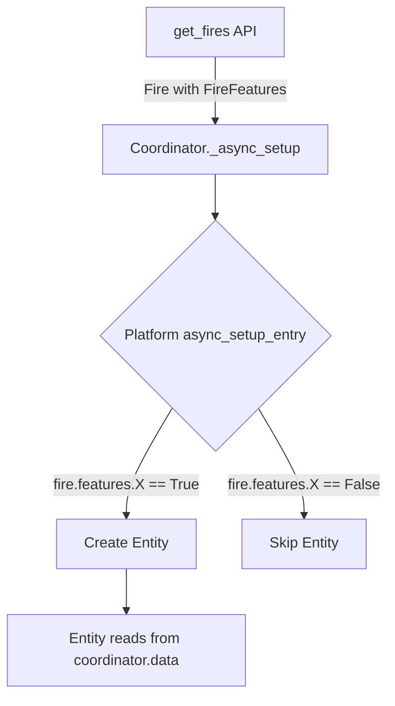
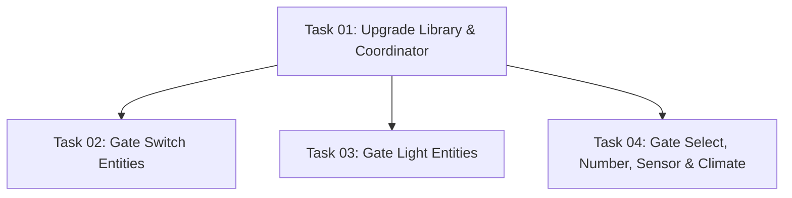

# Plan: Feature-Gated Entity Creation

## Original Work Order

> There is a new version of flameconnect (0.4.0) that has APIs for detecting fireplace features. We should integrate them into the config workflow so that devices only have entities that are actually supported.

## Plan Clarifications

| Question | Answer |
|----------|--------|
| How should the pulsating effect switch be handled (no feature flag)? | Always create — core flame feature |
| Should climate preset_modes be dynamic based on feature flags? | Yes — filter based on `power_boost` and `fan_only` flags |
| Is the proposed feature-to-entity mapping correct? | Confirmed correct |

## Executive Summary

The flameconnect library v0.4.0 introduces a `FireFeatures` dataclass with 23 boolean feature flags parsed from the API's `FireFeature` JSON object. These flags are available on every `Fire` object returned by both `get_fires()` and `get_fire_overview()`.

Currently, the integration creates all ~20 entities per fireplace regardless of hardware capabilities. Only the climate entity has conditional creation (checking for `HeatParam`/`HeatModeParam` presence). This plan upgrades the library dependency and uses `FireFeatures` to gate entity creation, so each device only exposes entities for features it actually supports.

The approach is straightforward: check `fire.features.<flag>` in each platform's `async_setup_entry()` before creating entities. No config flow UI changes or config entry data changes are needed — features are discovered automatically from the API at runtime.

## Context

### Current State vs Target State

| Current State | Target State | Why? |
|---|---|---|
| Library pinned at `flameconnect==0.3.0` | Library pinned at `flameconnect==0.4.0` | Access `FireFeatures` API |
| All 20 entities created per fire (except climate) | Only entities matching `FireFeatures` flags created | Avoid exposing non-functional controls |
| Climate checks parameter presence for creation | Climate checks `simple_heat \|\| advanced_heat` feature flag | Use authoritative feature source |
| Climate exposes static preset list (normal, boost, eco, fan_only, schedule) | Climate presets filtered by `power_boost` and `fan_only` flags | Don't expose unsupported modes |
| Coordinator logs `with_heat`, `brand`, `model` at discovery | Coordinator also logs feature flags | Debugging visibility |

### Background

The `FireFeatures` dataclass contains 23 boolean fields parsed from the API's `FireFeature` JSON response. It is available as `Fire.features` (default: all `False`). The `Fire` object is populated both during `get_fires()` (discovery at setup) and within each `FireOverview` returned by `get_fire_overview()` (periodic refresh). This means features are available in both `coordinator.fires` (for entity creation) and `coordinator.data[fire_id].fire.features` (at runtime).

**Confirmed feature-to-entity mapping:**

| `FireFeatures` Flag | Gated Entity(ies) | Platform |
|---|---|---|
| `simple_heat` OR `advanced_heat` | Climate | climate |
| `count_down_timer` | Timer switch, Timer duration, Timer end sensor | switch, number, sensor |
| `sound` | Sound volume, Sound file | number |
| `rgb_fuel_bed` | Media light | light |
| `rgb_back_light` | Overhead light | light |
| `rgb_log_effect` | Log effect light | light |
| `rgb_flame_accent` | Flame color select | select |
| `flame_dimming` | Brightness select | select |
| `moods` | Media theme select | select |
| `flame_fan_speed` | Flame speed number | number |
| `pir_toggle_smart_sense` | Ambient sensor switch | switch |
| `power_boost` | "boost" preset in climate | climate |
| `fan_only` | "fan_only" preset in climate | climate |

**Always-created entities (no feature gating):**

- Power switch, Flame effect switch, Pulsating effect switch
- Connection state sensor, Software version sensor, Error codes sensor
- Refresh button

## Architectural Approach

### Library Upgrade

**Objective**: Update the flameconnect dependency from 0.3.0 to 0.4.0 and add `FireFeatures` import where needed.

Update `manifest.json` to require `flameconnect==0.4.0`. The 0.4.0 release is backwards-compatible — the `Fire` dataclass gains a `features: FireFeatures` field with a default value of `FireFeatures()` (all `False`), so existing code continues to work before any gating logic is added.

### Feature-Gated Entity Creation

**Objective**: Modify each platform's `async_setup_entry()` to check feature flags before creating entities.

Each platform currently iterates over `coordinator.fires` and creates all entity descriptions unconditionally. The change adds feature flag checks at this level. The pattern per platform:

- **switch**: Gate `ambient_sensor` on `pir_toggle_smart_sense`, gate `timer` on `count_down_timer`. Power, flame effect, pulsating effect remain unconditional.
- **light**: Gate `media_light` on `rgb_fuel_bed`, `overhead_light` on `rgb_back_light`, `log_effect` on `rgb_log_effect`. Each light class gets created individually instead of all three unconditionally.
- **select**: Gate `flame_color` on `rgb_flame_accent`, `brightness` on `flame_dimming`, `media_theme` on `moods`.
- **number**: Gate `flame_speed` on `flame_fan_speed`, `timer_duration` on `count_down_timer`, `sound_volume` and `sound_file` on `sound`.
- **sensor**: Gate `timer_end` on `count_down_timer`. Connection state, software version, and error codes remain unconditional.
- **climate**: Replace current `HeatParam`/`HeatModeParam` parameter-presence check with `simple_heat or advanced_heat` feature flag check.
- **button**: No changes — refresh is always available.

To implement this cleanly, each gated entity description should be paired with its required feature flag. This can be done by mapping description keys to a lambda or attribute name on `FireFeatures`, then filtering in the setup loop. The exact implementation depends on the platform — some platforms (like switch and light) use dedicated classes per entity and will need per-entity conditionals, while others (like number and select) use a single class with description-driven behavior and can use a mapping dict.

### Dynamic Climate Presets

**Objective**: Filter the climate entity's preset list based on `power_boost` and `fan_only` feature flags.

The climate entity currently has a static class attribute `_attr_preset_modes = ["normal", "boost", "eco", "fan_only", "schedule"]`. This needs to become instance-level, computed from features. The entity already has access to features via `coordinator.data[fire_id].fire.features` at runtime. In the constructor, read the features and build the preset list: always include `normal`, `eco`, `schedule`; add `boost` if `power_boost` is `True`; add `fan_only` if `fan_only` is `True`.

### Coordinator Logging

**Objective**: Log feature flags at fire discovery for debugging.

Extend the existing debug log in `_async_setup()` to include a summary of enabled features (e.g., a comma-separated list of `True` flag names). This aids troubleshooting when users report missing entities.

## Risk Considerations and Mitigation Strategies

Technical Risks

- **API returns empty/default FireFeatures**: If the API doesn't populate `FireFeature` for a fire, all flags default to `False` and no gated entities are created. This is the correct behavior — if the API doesn't report features, the fire genuinely doesn't support them.
    - **Mitigation**: The coordinator debug logging will show which features are detected, making this easy to diagnose.

- **Feature flags disagree with parameter presence**: A fire might report a feature flag as `True` but not return the corresponding parameter in its overview (or vice versa). Entities already handle missing parameters gracefully by returning `None`.
    - **Mitigation**: The existing `_get_param()` pattern returns `None` for missing parameters, so entities will show "unknown" state rather than crash.

Implementation Risks

- **Entity removal breaks automations**: Fireplaces that previously had all entities will lose some after upgrading. Users with automations referencing removed entities will see errors.
    - **Mitigation**: This is expected and correct behavior — the removed entities represent non-functional controls. The entity registry will mark them as unavailable/orphaned rather than silently failing.

## Success Criteria

### Primary Success Criteria

1. `manifest.json` requires `flameconnect==0.4.0`
2. Each entity platform only creates entities for features the fireplace reports as supported via `FireFeatures`
3. Climate preset modes are filtered based on `power_boost` and `fan_only` feature flags
4. Always-created entities (power, flame effect, pulsating effect, diagnostics, refresh) are unaffected
5. `script/check` passes with no new errors

## Documentation

- Update `AGENTS.md` Integration Structure section to note that entity creation is feature-gated
- Update coordinator debug logging documentation if applicable

## Resource Requirements

### Development Skills

- Python async patterns
- Home Assistant entity platform setup conventions
- FlameConnect API and data model familiarity

### Technical Infrastructure

- flameconnect 0.4.0 from PyPI
- Existing development scripts (`script/check`, `script/test`, `script/develop`)

## Notes

- The `FireFeatures` dataclass has additional flags (`seven_day_timer`, `flame_height`, `front_light_amber`, `lgt1_to_5`, `flame_amber`, `media_accent`, `requires_warm_up`, `apply_flame_only_first`, `check_if_remote_was_used`) that don't map to current entities. These are noted but not acted on — they may inform future entity additions.
- The `with_heat` boolean on `Fire` is now redundant with `simple_heat`/`advanced_heat` feature flags but remains available for backwards-compatible checks.

## Dependency Diagram

## Execution Blueprint

**Validation Gates:**
- Reference: `/config/hooks/POST_PHASE.md`

### ✅ Phase 1: Infrastructure
**Parallel Tasks:**
- ✔️ Task 01: Upgrade flameconnect library to 0.4.0 and enhance coordinator logging

### ✅ Phase 2: Feature-Gated Entity Creation
**Parallel Tasks:**
- ✔️ Task 02: Gate switch entity creation on feature flags (depends on: 01)
- ✔️ Task 03: Gate light entity creation on feature flags (depends on: 01)
- ✔️ Task 04: Gate select, number, sensor, and climate entities on feature flags (depends on: 01)

### Execution Summary
- Total Phases: 2
- Total Tasks: 4
- Maximum Parallelism: 3 tasks (in Phase 2)
- Critical Path Length: 2 phases

## Execution Summary

**Status**: Completed Successfully
**Completed Date**: 2026-02-27

### Results
All 4 tasks completed across 2 phases. The flameconnect library was upgraded from 0.3.0 to 0.4.0, and 13 entities across 6 platforms are now conditionally created based on `FireFeatures` flags. Climate presets are dynamically built from `power_boost` and `fan_only` flags. 7 core entities remain unconditionally created. All validation checks pass (`script/check` clean, 40/40 relevant tests pass).

### Noteworthy Events
- The virtual environment needed manual upgrade to flameconnect 0.4.0 after updating `manifest.json` — type checking failed until the installed package matched.
- Test fixtures required updating: the `mock_fire` fixture needed `FireFeatures` with all flags enabled to represent a full-featured test fireplace.
- 2 pre-existing config flow test failures (unrelated `TypeError: object str can't be used in 'await' expression`) were confirmed as pre-existing by running tests against the pre-change codebase.

### Recommendations
- Fix the pre-existing config flow test failures (`test_user_step_happy_path`, `test_reauth_step_happy_path`).
- Consider adding tests for feature-gated entity creation (e.g., verify that a fire with `sound=False` doesn't create sound number entities).
